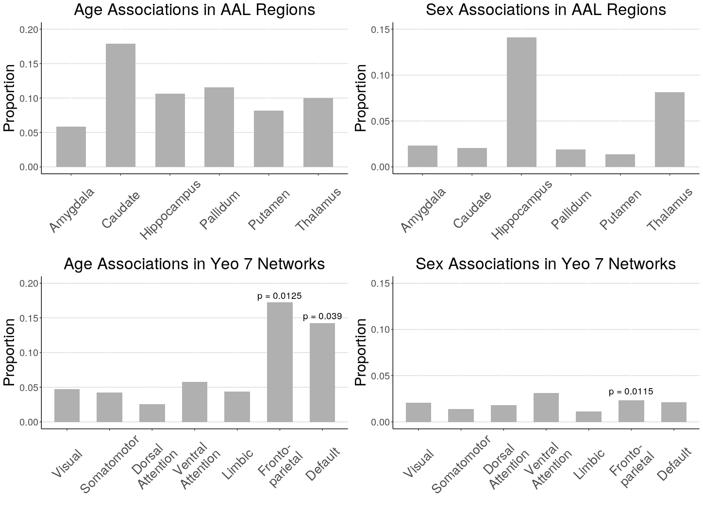
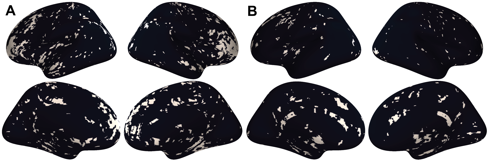

# Results

## Coupling varies across the cortical surface and is increased in specific regions, bilaterally 
  We calculated voxel-wise mean and variance maps of coupling values to characterize spatial patterns in CBF-ALFF-ReHo coupling and visualized these on the FreeSurfer sphere. Throughout the cortical surface, all voxels showed strong coupling, and voxels with stronger average coupling also had higher variance between subjects [TODO: get correlation between mean and variance]. The average voxel-wise mean coupling value was 0.99 (sd = 0.37; range from 0.27 to 3.30). The average voxel-wise variance was 0.91 (sd = 0.20; range from 0.45 to 2.64).
  
  Visual comparison of voxel-wise descriptive maps with the Desikan-Killiany cortical atlas [@desikanAutomatedLabelingSystem2006a] suggested that coupling is especially strong in the following regions, bilaterally: superior frontal gyrus, paracentral gyrus, caudal anterior cingulate, posterior cingulate, isthmus cingulate, pericalcarine, lateral occipital, and insula (Figure \@ref(fig:desc)). These regions also tended to show higher variance. Comparing to the Yeo 7 functional networks, areas of strong coupling are observed primarily in the default and frontoparietal networks \@ref(fig:barplot).

  These voxel-wise descriptive maps of coupling showed unique information to descriptive maps of each of the individual modalities (Supplementary Figures \@ref(fig:cbf), \@ref(fig:alff), and \@ref(fig:reho)).
  
```{r desc, fig.cap = "A) Voxel-wise means across subjects of cortical coupling coefficients between CBF, ALFF, and ReHo. Larger values indicate stronger coupling. B) Voxel-wise variances across subjects of cortical coupling coefficients between CBF, ALFF, and ReHo."}
knitr::include_graphics("figures/coupling_desc-01.png")
```
  
## CBF-ALFF-ReHo coupling evolves with age throughout gray matter structures
  Linear associations between strength of coupling and age were present in subcortical structures and cortical networks (Figure \@ref(fig:barplot); corrected p < 0.05). In subcortical structures, age-related changes in CBF-ALFF-ReHo coupling occurred primarily in the caudate and pallidum, though such changes were also observed in sizable proportions of the hippocampus, putamen, and thalamus.
  
```{r barplot, fig.cap = "Proportion of voxels in AAL subcortical regions and Yeo 7 cortical networks that showed significant age and sex effects when race and in-scanner motion were corrected included as covariates (FDR corrected p < 0.05). Spin test was performed for Yeo 7 networks and significant p-values are reported (p < 0.05)."}

# [TODO: Should I change to Jaccard? Or change spin test to proportions?]
# TODO: change range to 0.20
```

  In cortical networks, coupling and age associations were rare in all networks except the frontoparietal and default networks (Figure \@ref(fig:binary)). These two networks were also the networks in which the average strength of coupling across subjects appeared to be highest (Figure \@ref(fig:desc)). Spin testing between functional networks and age-related changes in coupling showed enrichment of coupling and age associations in the frontoparietal (p = 0.013) and default networks (p = 0.039).
  
```{r binary, fig.cap = "A) Thresholded maps of voxels with significant coupling associations with age after FDR correction at 0.05. B) Thresholded maps of voxels with significant coupling associations with sex after FDR correction at 0.05."}

```
  
## CBF-ALFF-ReHo coupling varies between males and females, primarily in subcortical regions
  Associations between CBF-ALFF-ReHo coupling and sex were present primarily in the hippocampus and thalamus (Figure \@ref(fig:barplot); corrected p < 0.05). Sex differences in coupling were rare in other subcortical structures and all functional networks -- only 1% to 3% of voxels in these regions showed coupling and sex associations (Figure \@ref(fig:binary)). Spin testing between functional networks and sex-related changes in coupling revealed enrichment of coupling and sex associations in the frontoparietal network (p = 0.012), despite the small proportion of the frontoparietal network that exhibited coupling associations with sex.
