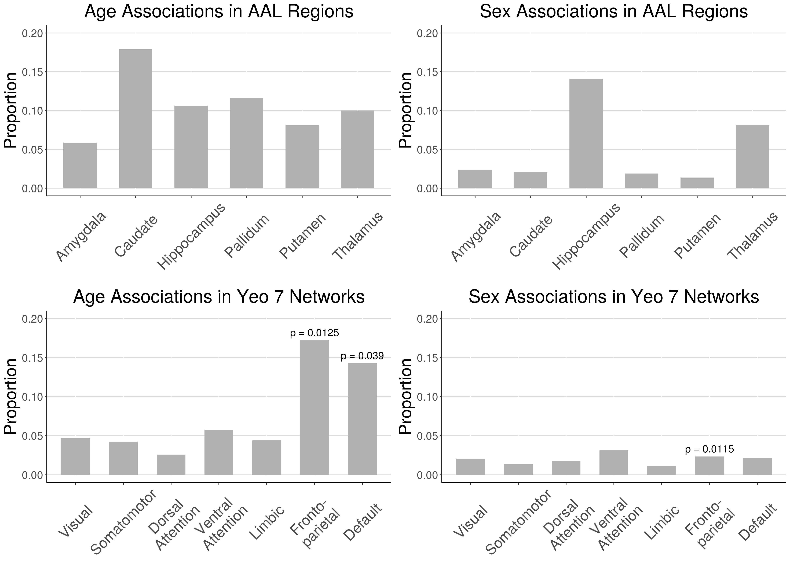

# Results 

## Coupling varies across the cortical surface and is increased in discrete regions, bilaterally 
  We calculated voxel-wise mean and variance maps of coupling values to characterize spatial patterns in CBF-ALFF-ReHo coupling and visualized these on the cortical surface. Throughout the cortical surface, all voxels, on average, showed strong coupling, and voxels with stronger average coupling also tended to have higher variance between subjects (Pearson correlation = 0.69). The average voxel-wise mean coupling value was 0.99 (sd = 0.37; range = [0.27, 3.30]). The average voxel-wise variance was 0.91 (sd = 0.20; range = [0.45, 2.64]).
  
  Visual comparison of voxel-wise descriptive maps with the Desikan-Killiany cortical atlas [@desikanAutomatedLabelingSystem2006a] suggested that coupling is especially strong in the following regions, bilaterally: superior frontal gyrus, paracentral gyrus, caudal anterior cingulate, posterior cingulate, isthmus cingulate, pericalcarine, lateral occipital, and insula (Figure \@ref(fig:desc)). Comparing to the Yeo 7 functional networks, areas of strong coupling are observed primarily in the frontoparietal (p = 0.0125) and default networks (p = 0.039; Figure \@ref(fig:barplot)).

  These voxel-wise descriptive maps of coupling showed unique information when compared to the descriptive maps of each of the individual modalities (Supplementary Figure \@ref(fig:supplement)).
  
```{r desc, fig.cap = "Coupling values are spatially heterogeneous across the cortical surface. A) Voxel-wise means across subjects of cortical coupling values between CBF, ALFF, and ReHo. Larger values indicate stronger coupling. B) Voxel-wise variances across subjects of cortical coupling values between CBF, ALFF, and ReHo."}
knitr::include_graphics("figures/coupling_desc-01.png")
```
  
  
```{r barplot, fig.cap = "Proportion of voxels in AAL subcortical regions and Yeo 7 cortical networks that showed significant coupling-age and coupling-sex associations when in-scanner motion was included as a covariate (FDR corrected p < 0.05). Spin test was performed for all Yeo 7 networks; significant p-values are reported (p < 0.05)."}

```

## CBF-ALFF-ReHo coupling evolves with age throughout gray matter structures 
  Linear associations between strength of coupling and age were present in subcortical structures and cortical networks (Figure \@ref(fig:barplot); corrected p < 0.05). Figure \@ref(fig:ageexample) shows an example of such an association between coupling and age as well as individual modalities and age at one voxel in the default network. In subcortical structures, age-related changes in CBF-ALFF-ReHo coupling occurred primarily in the caudate and pallidum, though such changes were also common in the hippocampus, putamen, and thalamus.
  
  In cortical networks, coupling and age associations were rare in all networks except the frontoparietal and default networks (Figure \@ref(fig:binary)). These two networks were also the networks in which the average strength of coupling across subjects appeared to be highest (Figure \@ref(fig:desc)). Spin testing between functional networks and age-related changes in coupling showed enrichment of coupling and age associations in the frontoparietal (p = 0.013) and default networks (p = 0.039).
  
```{r ageexample, fig.cap = "Example of associations between individual modalities and age as well as associations between coupling and age at a single voxel in the default network. Each point represents the value at that voxel for one subject. Best-fit lines from univariate linear regression are shown."}

```

```{r binary, fig.cap = "A) Thresholded maps of voxels with significant coupling associations with age after FDR correction at 0.05. B) Thresholded maps of voxels with significant coupling associations with sex after FDR correction at 0.05."}
knitr::include_graphics("figures/coupling_binary-01.png")
```

## CBF-ALFF-ReHo coupling varies between males and females, primarily in subcortical regions 
  Associations between CBF-ALFF-ReHo coupling and sex were present primarily in the hippocampus and thalamus (Figure \@ref(fig:barplot); corrected p < 0.05). Sex differences in coupling were rare in other subcortical structures and all functional networks -- only 1% to 3% of voxels in these regions showed coupling and sex associations (Figure \@ref(fig:binary)). Spin testing between functional networks and sex-related changes in coupling revealed enrichment of coupling and sex associations in the frontoparietal network (p = 0.012), despite the small proportion of the frontoparietal network that exhibited coupling associations with sex.

## pIMCo provides a consistent estimator of local coupling compared to WLR-based IMCo
   In 2016, Vandekar et al. introduced a method to study IMCo relationships at the single voxel level based on local weighted linear regression (WLR) slopes [@vandekarSubjectlevelMeasurementLocal2016]. Because this method relies on estimating WLR slopes between modalities, it is inherently limited to the two-modality setting, cannot account for statistical relationship between modalities, and requires specification of one modality as the independent variable, leading to asymmetry. These limitations are demonstrated by a two-modality example in Figure \@ref(fig:wlrpca). We see that, if ALFF is defined as the independent variable, the WLR coupling value is 0.25, indicating little coupling, but if CBF is defined as the independent variable, the WLR coupling value is 1.25, indicating five times as much coupling. Thus, when using WLR-based IMCo, two possible coupling values exist at every voxel, and there are no guarantees that analyses will show comparable findings between the two. Additionally, these WLR coupling values only describe the trend of the relationship between ALFF and CBF, but do not account for the statistical strength of that relationship.
   
   In contrast, the pIMCo coupling value is 2.13 and does not require specification of which modality is treated as the independent variable, leading to a symmetric and consistent definition of coupling. This pIMCo value does not describe the effect size of the relationship between ALFF and CBF and instead describes the strength and shape of the relationship -- a high value of coupling suggests that the shape of data from that neighborhood looks like a long ellipsoid, while a low value of coupling suggests that the shape is more spherical.
   
```{r wlrpca, fig.cap = "Two-modality example showing pIMCo results in comparison to WLR-based IMCo results. Blue line represents coupling value from WLR-based IMCo if ALFF is defined as the independent variable (slope = 0.25). Orange line represents coupling value from WLR-based IMCo if CBF is defined as the independent variable (slope = 1.25). Black line and ellipse represent PCA results; no reference specification is needed (coupling value = 2.13). Larger dot sizes correspond to increased weights in the WLR and weighted PCA."}

```
